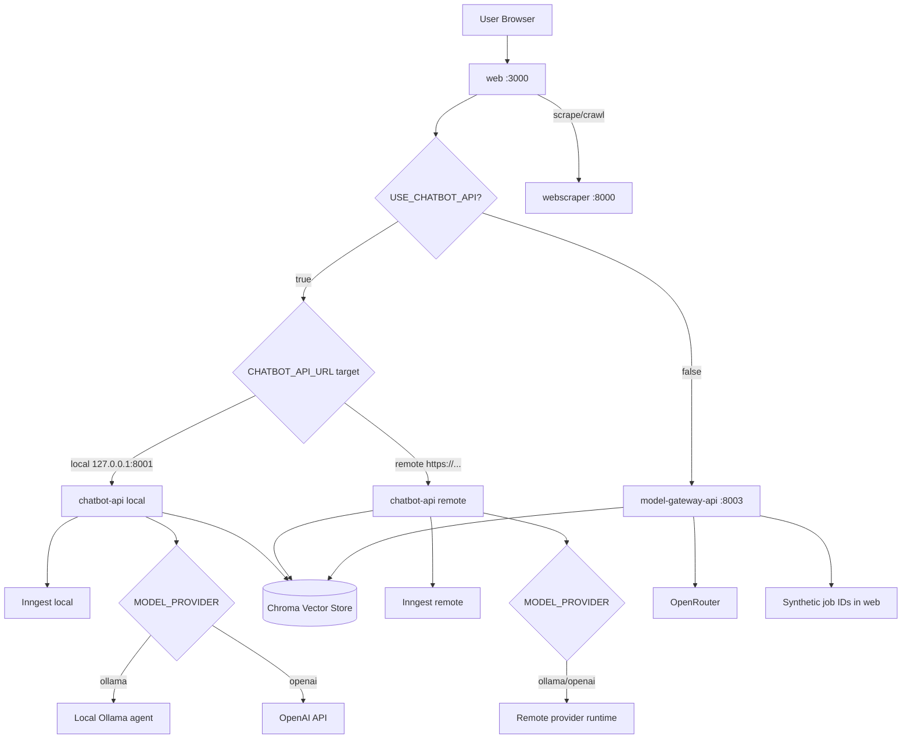

# AI Chatbot Platform Monorepo

This file is the main project context and operations guide for the monorepo.

It consolidates:

- core platform context (previously in `context.md`)
- app-level documentation from `docs/apps/*`
- system-level setup, runtime, and troubleshooting

## Platform Overview

This is an AI-powered chatbot platform with:

- Next.js web application (dashboard + API facade)
- FastAPI chatbot backends (async and direct model gateway paths)
- FastAPI web scraping service
- MongoDB-backed auth/RBAC/data models
- Chroma vector storage for RAG knowledge

## Current State

### Backend routing toggle in web

- `USE_CHATBOT_API=true` routes chatbot calls to `chatbot-api`.
- `USE_CHATBOT_API=false` routes chatbot calls to `model-gateway-api`.
- `POST /api/chatbot/ingest` remains on `chatbot-api` (Inngest flow).

### Dashboard compatibility

- Dashboard query contract expects async jobs (`event_ids` + polling).
- `model-gateway-api` is synchronous, so web creates synthetic jobs to preserve existing frontend behavior.

### Shared vector storage

- `chatbot-api` and `model-gateway-api` use the same Chroma persistence location and collection by default.

## Repository Structure

```text
monorepo/
├── apps/
│   ├── web/                  # Next.js app (port 3000)
│   ├── chatbot-api/          # FastAPI RAG + Inngest (port 8001)
│   ├── model-gateway-api/    # FastAPI model gateway + RAG (port 8003)
│   └── webscraper/           # FastAPI scraper/crawler (port 8000)
├── packages/
│   ├── auth/                 # @repo/auth shared auth package
│   ├── ui/                   # @repo/ui shared UI package
│   ├── eslint-config/        # @repo/eslint-config
│   └── typescript-config/    # @repo/typescript-config
└── docs/
    └── apps/
        ├── web/
        ├── chatbot-api/
        ├── model-gateway-api/
        └── webscraper/
```

## App Documentation Index

- [`docs/apps/web/README.md`](./docs/apps/web/README.md)
- [`docs/apps/chatbot-api/README.md`](./docs/apps/chatbot-api/README.md)
- [`docs/apps/model-gateway-api/README.md`](./docs/apps/model-gateway-api/README.md)
- [`docs/apps/webscraper/README.md`](./docs/apps/webscraper/README.md)

## System Flow



## Setup

From `monorepo/`:

```powershell
npm run setup
```

This installs Node dependencies and sets up Python environments for:

- `webscraper`
- `chatbot-api`
- `model-gateway-api`

## Running the System

### Full stack

```powershell
npm run dev
```

Default ports:

- `web`: 3000
- `chatbot-api`: 8001
- `model-gateway-api`: 8003
- `webscraper`: 8000

### Inngest (for chatbot-api async jobs)

Run in a second terminal:

```powershell
npm run dev:chatbot-inngest
```

Non-PowerShell:

```bash
npx inngest-cli@latest dev -u http://127.0.0.1:8001/api/inngest
```

## Chatbot Runtime Flows

The platform supports two primary chatbot execution flows in production and development.

### Flow A: Inngest + Local Agent (chatbot-api async path)

Use this when you want async job orchestration and/or local model execution (for example Ollama).

How it works:

1. Client sends chat request to `web` route `POST /api/chatbot/query`.
2. `web` validates auth, permissions, session, and source IDs.
3. `web` forwards to `chatbot-api` `POST /v1/query` with `x-user-id`.
4. `chatbot-api` emits Inngest event `chatbot/query` and returns `event_ids`.
5. UI polls `GET /api/chatbot/jobs/{eventId}` via `web`.
6. `web` proxies to `chatbot-api` `GET /v1/jobs/{event_id}`.
7. `chatbot-api` fetches run status/output from Inngest and returns final answer.

Ingest flow:

- `POST /api/chatbot/ingest` in `web` forwards PDF to `chatbot-api /v1/ingest`.
- `chatbot-api` saves upload and emits Inngest event `chatbot/ingest_pdf`.
- Worker step chunks/embeds and stores data in Chroma.

Model provider behavior inside `chatbot-api`:

- `MODEL_PROVIDER=ollama` => local agent/local model runtime through `OLLAMA_BASE_URL`.
- `MODEL_PROVIDER=openai` => remote OpenAI API calls.
- In both cases, orchestration pattern remains async through Inngest for `/v1/query`.

Required services for this flow:

- `web` (3000)
- `chatbot-api` (8001)
- Inngest dev/server (`INNGEST_API_BASE_URL`, `INNGEST_EVENT_API_BASE_URL`)
- Optional local Ollama if `MODEL_PROVIDER=ollama`

Typical config:

- `USE_CHATBOT_API=true`
- `CHATBOT_API_URL=http://127.0.0.1:8001` (or your deployed URL)
- `MODEL_PROVIDER=ollama` for local model runtime

### Flow B: Remote chatbot-api server (same contract, remote runtime)

Use this when `web` should call a hosted `chatbot-api` instead of local `127.0.0.1`.

How it works:

1. `web` still receives `POST /api/chatbot/query`.
2. With `USE_CHATBOT_API=true`, `web` calls `${CHATBOT_API_URL}/v1/query`.
3. Hosted `chatbot-api` emits/handles Inngest events in remote infra.
4. `web` job polling route calls `${CHATBOT_API_URL}/v1/jobs/{event_id}`.
5. Frontend behavior remains unchanged because API contract is identical (`event_ids` + polling).

What changes vs Flow A:

- Runtime location changes (local machine -> remote server).
- Infra ownership moves to deployed service environment.
- `web` code path does not change.

Typical config:

- `USE_CHATBOT_API=true`
- `CHATBOT_API_URL=https://<your-remote-chatbot-api>`
- Remote env defines provider choice (`openai` or `ollama`) and Inngest URLs.

### Related fallback flow (for completeness)

If `USE_CHATBOT_API=false`, `web` calls `model-gateway-api /api/chat/completions` (synchronous) and creates synthetic job IDs to keep dashboard polling behavior compatible.

## App-by-App Summary

### web

Responsibilities:

- User-facing pages and dashboard
- Auth and RBAC enforcement
- API facade to chatbot/scraper services
- Mongo persistence for sessions/messages/crawl jobs/documents/users/roles

Key flows:

- Query flow: `web -> chatbot-api` (async) or `web -> model-gateway-api` (sync + synthetic job)
- Scraper flow: `web -> webscraper -> web persistence -> chatbot ingest`

Important API groups:

- `/api/auth/*`
- `/api/chatbot/*`
- `/api/scraper/*`
- `/api/admin/*`

### chatbot-api

Responsibilities:

- PDF/text ingest into Chroma
- RAG query over user sources
- Async orchestration via Inngest

Key endpoints:

- `GET /v1/health`
- `POST /v1/ingest`
- `POST /v1/ingest-text`
- `POST /v1/query`
- `POST /v1/query/sync`
- `GET /v1/jobs/{event_id}`
- `GET /v1/sources`
- `DELETE /v1/sources/{source_id}`

### model-gateway-api

Responsibilities:

- Chat completion endpoint
- Direct RAG ingest/query endpoints
- Free-model allowlist enforcement for chat requests

Key endpoints:

- `GET /api/health`
- `POST /api/chat/completions`
- `POST /api/rag/ingest`
- `POST /api/rag/ingest-text`
- `POST /api/rag/query`
- `GET /api/rag/sources`
- `DELETE /api/rag/sources/{source_id}`

### webscraper

Responsibilities:

- Single page scrape (auto/static/dynamic)
- Multi-page crawl with streamed progress
- Structured extraction output for downstream ingestion

Key endpoints:

- `GET /health`
- `POST /api/v1/scrape`
- `POST /api/v1/crawl/stream`

## Shared Packages

### `@repo/auth`

Shared auth package with:

- auth types and validators
- JWT/password/token/cookie utilities
- auth-oriented React hooks/components

### `@repo/ui`

Shared UI component package with common form and UI primitives.

## Environment Variables

### web (`apps/web/.env.local`)

Core:

- `JWT_SECRET`
- `JWT_EXPIRES_IN_SECONDS`
- `BCRYPT_SALT_ROUNDS`
- `MONGODB_URI`
- `MONGODB_DB_NAME`
- `RESEND_API_KEY`
- `EMAIL_FROM`
- `NEXT_PUBLIC_APP_URL`
- `USE_CHATBOT_API`

Integrations:

- `CHATBOT_API_URL` (default `http://127.0.0.1:8001`)
- `MODEL_GATEWAY_API_URL` (default `http://127.0.0.1:8003`)
- `SCRAPER_API_URL` (default `http://localhost:8000`)

### chatbot-api (`apps/chatbot-api/.env`)

- `APP_ENV`, `APP_HOST`, `APP_PORT`, `LOG_LEVEL`
- `MODEL_PROVIDER` (`openai` | `ollama`)
- `OPENAI_API_KEY`, `OPENAI_CHAT_MODEL`, `OPENAI_EMBED_MODEL`
- `OLLAMA_BASE_URL`, `OLLAMA_CHAT_MODEL`, `OLLAMA_EMBED_MODEL`
- `OLLAMA_TIMEOUT_SECONDS`, `OLLAMA_GENERATE_TIMEOUT_SECONDS`
- `CHROMA_PERSIST_DIR`, `CHROMA_COLLECTION`
- `AUTH_JWT_SECRET`, `SERVICE_API_KEY`
- `INNGEST_APP_ID`, `INNGEST_API_BASE_URL`, `INNGEST_EVENT_API_BASE_URL`

### model-gateway-api (`apps/model-gateway-api/.env`)

- `APP_NAME`, `APP_ENV`, `APP_VERSION`, `API_PREFIX`
- `OPEN_ROUTER_API_KEY`
- `DEFAULT_MODEL`
- `OPEN_ROUTER_EMBED_MODEL`

### webscraper (`apps/webscraper/.env`)

- `SCRAPER_API_KEY`
- `SCRAPER_ALLOWED_DOMAINS`
- `SCRAPER_REQUEST_TIMEOUT_SECONDS`
- `SCRAPER_PLAYWRIGHT_TIMEOUT_MS`
- `SCRAPER_MAX_CONCURRENT_REQUESTS`
- `SCRAPER_MAX_RETRIES`
- `SCRAPER_RATE_LIMIT_PER_MINUTE`

## Security and Access Controls

### Page-level RBAC

Dashboard routes are server-side gated with `requirePagePermission(...)`.

### API-level permission checks

Protected route handlers enforce permission gates and return auth/permission errors consistently.

### Rate limiting

Mongo-backed fixed-window rate limiting is applied to high-cost endpoints (auth, scrape/crawl, chatbot query/ingest, widget chat).

## Embeddable Widget

Current widget behavior:

- Script: `apps/web/public/chatbot-widget.js`
- Reads `data-bot-id`
- Fetches config and posts chat to widget APIs
- Dynamic color styling and mobile-friendly behavior

Public widget APIs:

- `POST /api/chatbot/widget/chat`
- `GET /api/chatbot/widget/config/[botId]`

## Known Issues

- Avoid stale global `node_modules` folders that can break turbo resolution.
- Ensure service ports do not conflict when running custom stacks.
- If chat/scrape proxies return 502, verify backend services and env URLs.

## Validation Commands

```bash
npm run lint
npm run check-types
```

Per app:

```bash
npm run test --workspace=web
npm run test --workspace=chatbot-api
npm run test --workspace=model-gateway-api
npm run test --workspace=webscraper
```

## Detailed Docs

System-level docs:

- [`docs/README.md`](./docs/README.md)

web:

- [`docs/apps/web/README.md`](./docs/apps/web/README.md)
- [`docs/apps/web/architecture.md`](./docs/apps/web/architecture.md)
- [`docs/apps/web/api.md`](./docs/apps/web/api.md)
- [`docs/apps/web/operations.md`](./docs/apps/web/operations.md)

chatbot-api:

- [`docs/apps/chatbot-api/README.md`](./docs/apps/chatbot-api/README.md)
- [`docs/apps/chatbot-api/architecture.md`](./docs/apps/chatbot-api/architecture.md)
- [`docs/apps/chatbot-api/api.md`](./docs/apps/chatbot-api/api.md)
- [`docs/apps/chatbot-api/operations.md`](./docs/apps/chatbot-api/operations.md)

model-gateway-api:

- [`docs/apps/model-gateway-api/README.md`](./docs/apps/model-gateway-api/README.md)
- [`docs/apps/model-gateway-api/architecture.md`](./docs/apps/model-gateway-api/architecture.md)
- [`docs/apps/model-gateway-api/api.md`](./docs/apps/model-gateway-api/api.md)
- [`docs/apps/model-gateway-api/operations.md`](./docs/apps/model-gateway-api/operations.md)

webscraper:

- [`docs/apps/webscraper/README.md`](./docs/apps/webscraper/README.md)
- [`docs/apps/webscraper/architecture.md`](./docs/apps/webscraper/architecture.md)
- [`docs/apps/webscraper/api.md`](./docs/apps/webscraper/api.md)
- [`docs/apps/webscraper/operations.md`](./docs/apps/webscraper/operations.md)
