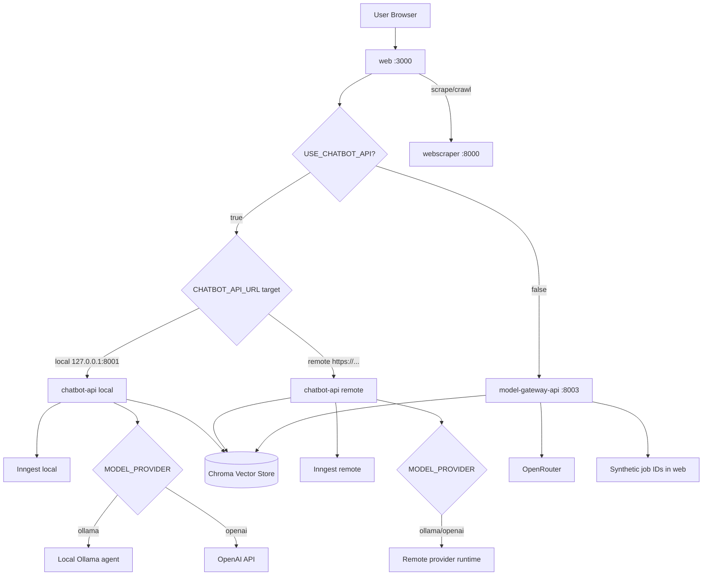

# AI Chatbot Platform Monorepo

This file is the main project context and operations guide for the monorepo.

It consolidates:

- core platform context (previously in `context.md`)
- app-level documentation from `docs/apps/*`
- system-level setup, runtime, and troubleshooting

## Platform Overview

This is an AI-powered chatbot platform with:

- Next.js web application (dashboard + API facade)
- FastAPI chatbot backends (async and direct model gateway paths)
- FastAPI web scraping service
- MongoDB-backed auth/RBAC/data models
- Chroma vector storage for RAG knowledge

## Current State

### Backend routing toggle in web

- `USE_CHATBOT_API=true` routes **dashboard chat queries** (`POST /api/chatbot/query`) and the **public widget** chat path to `chatbot-api`.
- `USE_CHATBOT_API=false` routes those flows to **`model-gateway-api`** (sync response + synthetic job ids for the same UI contract).
- **Ingest, document library, and vector deletes** always use the URL from **`CHATBOT_API_URL`** (or **`NEXT_PUBLIC_CHATBOT_API_BASE_URL`**) — they talk to **`chatbot-api`** regardless of `USE_CHATBOT_API`, so scraped text and PDF ingest land in the same Chroma instance the web app lists and deletes.

### Dashboard compatibility

- Dashboard query contract expects async jobs (`event_ids` + polling).
- `model-gateway-api` is synchronous, so web creates synthetic jobs to preserve existing frontend behavior.

### Shared vector storage

- `chatbot-api` and `model-gateway-api` use the same Chroma persistence location and collection by default (see `monorepo/chroma_data` and `CHROMA_COLLECTION` in `.env.shared` / per-app env).
- **Embedding dimensions must match** whatever wrote the vectors: if you change embedding model or backend, re-ingest or clear Chroma.

### Shared Python environment (`monorepo/.env.shared`)

- Copy `monorepo/.env.shared.example` to **`monorepo/.env.shared`** (the real file is gitignored).
- **`chatbot-api`** and **`model-gateway-api`** load it **before** each app’s own `.env` / `.env.local`, so shared defaults live in one place; app-specific files **override** on duplicate keys.
- Typical contents: **`EMBEDDING_BACKEND`** (and related OpenRouter / Ollama / OpenAI vars), optional **`CHROMA_COLLECTION`** / **`CHROMA_PERSIST_DIR`**, optional shared **`OPEN_ROUTER_*`** defaults. Keep secrets in `apps/*/.env.local` where possible.

## Repository Structure

```text
monorepo/
├── apps/
│   ├── web/                  # Next.js app (port 3000)
│   ├── chatbot-api/          # FastAPI RAG + Inngest (port 8001)
│   ├── model-gateway-api/    # FastAPI model gateway + RAG (port 8003)
│   └── webscraper/           # FastAPI scraper/crawler (port 8000)
├── packages/
│   ├── auth/                 # @repo/auth shared auth package
│   ├── ui/                   # @repo/ui shared UI package
│   ├── eslint-config/        # @repo/eslint-config
│   └── typescript-config/    # @repo/typescript-config
└── docs/
    └── apps/
        ├── web/
        ├── chatbot-api/
        ├── model-gateway-api/
        └── webscraper/
```

## App Documentation Index

- [`docs/apps/web/README.md`](./docs/apps/web/README.md)
- [`docs/apps/chatbot-api/README.md`](./docs/apps/chatbot-api/README.md)
- [`docs/apps/model-gateway-api/README.md`](./docs/apps/model-gateway-api/README.md)
- [`docs/apps/webscraper/README.md`](./docs/apps/webscraper/README.md)

## System Flow



Paths not shown as branches off **`USE_CHATBOT_API`**: PDF ingest, scrape/crawl **`/v1/ingest-text`**, and document/source HTTP calls from **`web`** always target **`CHATBOT_API_URL`** (same host as the diagram’s **`chatbot-api`** box when local).

## Setup

From `monorepo/`:

```powershell
npm run setup
```

This installs Node dependencies and sets up Python environments for:

- `webscraper`
- `chatbot-api`
- `model-gateway-api`

## Running the System

### Full stack

```powershell
npm run dev
```

Default ports:

- `web`: 3000
- `chatbot-api`: 8001
- `model-gateway-api`: 8003
- `webscraper`: 8000

### Inngest (for chatbot-api async jobs)

Run in a second terminal:

```powershell
npm run dev:chatbot-inngest
```

Non-PowerShell:

```bash
npx inngest-cli@latest dev -u http://127.0.0.1:8001/api/inngest
```

## Chatbot Runtime Flows

The platform supports two primary chatbot execution flows in production and development.

### Flow A: Inngest + Local Agent (chatbot-api async path)

Use this when you want async job orchestration and/or local model execution (for example Ollama).

How it works:

1. Client sends chat request to `web` route `POST /api/chatbot/query`.
2. `web` validates auth, permissions, session, and source IDs.
3. `web` forwards to `chatbot-api` `POST /v1/query` with `x-user-id`.
4. `chatbot-api` emits Inngest event `chatbot/query` and returns `event_ids`.
5. UI polls `GET /api/chatbot/jobs/{eventId}` via `web`.
6. `web` proxies to `chatbot-api` `GET /v1/jobs/{event_id}`.
7. `chatbot-api` fetches run status/output from Inngest and returns final answer.

Ingest flow:

- `POST /api/chatbot/ingest` in `web` forwards PDF to `chatbot-api /v1/ingest`.
- `chatbot-api` saves upload and emits Inngest event `chatbot/ingest_pdf`.
- Worker step chunks/embeds and stores data in Chroma.

Model provider behavior inside `chatbot-api`:

- `MODEL_PROVIDER=ollama` => local agent/local model runtime through `OLLAMA_BASE_URL`.
- `MODEL_PROVIDER=openai` => remote OpenAI API calls.
- In both cases, orchestration pattern remains async through Inngest for `/v1/query`.

Required services for this flow:

- `web` (3000)
- `chatbot-api` (8001)
- Inngest dev/server (`INNGEST_API_BASE_URL`, `INNGEST_EVENT_API_BASE_URL`)
- Optional local Ollama if `MODEL_PROVIDER=ollama`

Typical config:

- `USE_CHATBOT_API=true`
- `CHATBOT_API_URL=http://127.0.0.1:8001` (or your deployed URL)
- `MODEL_PROVIDER=ollama` for local model runtime

### Flow B: Remote chatbot-api server (same contract, remote runtime)

Use this when `web` should call a hosted `chatbot-api` instead of local `127.0.0.1`.

How it works:

1. `web` still receives `POST /api/chatbot/query`.
2. With `USE_CHATBOT_API=true`, `web` calls `${CHATBOT_API_URL}/v1/query`.
3. Hosted `chatbot-api` emits/handles Inngest events in remote infra.
4. `web` job polling route calls `${CHATBOT_API_URL}/v1/jobs/{event_id}`.
5. Frontend behavior remains unchanged because API contract is identical (`event_ids` + polling).

What changes vs Flow A:

- Runtime location changes (local machine -> remote server).
- Infra ownership moves to deployed service environment.
- `web` code path does not change.

Typical config:

- `USE_CHATBOT_API=true`
- `CHATBOT_API_URL=https://<your-remote-chatbot-api>`
- Remote env defines provider choice (`openai` or `ollama`) and Inngest URLs.

### Related fallback flow (for completeness)

If `USE_CHATBOT_API=false`, `web` calls `model-gateway-api /api/chat/completions` (synchronous) and creates synthetic job IDs to keep dashboard polling behavior compatible.

## App-by-App Summary

### web

Responsibilities:

- User-facing pages and dashboard
- Auth and RBAC enforcement
- API facade to chatbot/scraper services
- Mongo persistence for sessions/messages/crawl jobs/documents/users/roles

Key flows:

- Query flow: `web -> chatbot-api` (async) or `web -> model-gateway-api` (sync + synthetic job), controlled by `USE_CHATBOT_API`.
- Scraper flow: `web -> webscraper -> Mongo (crawl jobs) -> chatbot-api /v1/ingest-text` + Mongo **`ChatbotDocument`** rows (site rows aggregate many pages).
- Knowledge base list (`GET /api/chatbot/documents`): primarily **Mongo**; if Mongo has **no** rows for the user, the handler **backfills from `chatbot-api` `/v1/sources`** using **non-URL** source ids only (so orphaned crawl chunks do not become dozens of fake library rows). Deletes remove vectors in **chatbot-api** then Mongo rows (including legacy per-page keys).

Important API groups:

- `/api/auth/*`
- `/api/chatbot/*`
- `/api/scraper/*`
- `/api/admin/*`

### chatbot-api

Responsibilities:

- PDF/text ingest into Chroma
- RAG query over user sources
- Async orchestration via Inngest

Key endpoints:

- `GET /v1/health`
- `POST /v1/ingest`
- `POST /v1/ingest-text`
- `POST /v1/query`
- `POST /v1/query/sync`
- `GET /v1/jobs/{event_id}`
- `GET /v1/sources`
- `DELETE /v1/sources/{source_id}`

### model-gateway-api

Responsibilities:

- Chat completion endpoint
- Direct RAG ingest/query endpoints
- Free-model allowlist enforcement for chat requests

Key endpoints:

- `GET /api/health`
- `POST /api/chat/completions`
- `POST /api/rag/ingest`
- `POST /api/rag/ingest-text`
- `POST /api/rag/query`
- `GET /api/rag/sources`
- `DELETE /api/rag/sources/{source_id}`

### webscraper

Responsibilities:

- Single page scrape (auto/static/dynamic)
- Multi-page crawl with streamed progress
- Structured extraction output for downstream ingestion

Key endpoints:

- `GET /health`
- `POST /api/v1/scrape`
- `POST /api/v1/crawl/stream`

## Shared Packages

### `@repo/auth`

Shared auth package with:

- auth types and validators
- JWT/password/token/cookie utilities
- auth-oriented React hooks/components

### `@repo/ui`

Shared UI component package with common form and UI primitives.

## Environment Variables

### Shared (`monorepo/.env.shared`)

Optional file loaded first by **`chatbot-api`** and **`model-gateway-api`**. See **`.env.shared.example`** for the full template. Highlights:

- **`EMBEDDING_BACKEND`** — where RAG embeddings are built. **`chatbot-api`**: `ollama` | `openrouter` | `openai`, or leave unset to mirror **`MODEL_PROVIDER`** (`openai` | `ollama` only). **`model-gateway-api`**: `openrouter` | `ollama` for vectors only (chat completions always use OpenRouter).
- **`CHROMA_COLLECTION`** / **`CHROMA_PERSIST_DIR`** — align both Python apps with the same Chroma directory/collection when both touch RAG.

### web (`apps/web/.env.local`)

Core:

- `JWT_SECRET`
- `JWT_EXPIRES_IN_SECONDS`
- `BCRYPT_SALT_ROUNDS`
- `MONGODB_URI`
- `MONGODB_DB_NAME`
- `RESEND_API_KEY`
- `EMAIL_FROM`
- `NEXT_PUBLIC_APP_URL`
- `USE_CHATBOT_API` (and optional `NEXT_PUBLIC_USE_CHATBOT_API` for widget build-time defaults)

Integrations:

- **`CHATBOT_API_URL`** (server routes; default `http://127.0.0.1:8001`) — **ingest, document CRUD, vector delete, scrape text ingest** always use this host.
- **`NEXT_PUBLIC_CHATBOT_API_BASE_URL`** — optional client-visible fallback; server prefers `CHATBOT_API_URL` when set.
- `MODEL_GATEWAY_API_URL` (default `http://127.0.0.1:8003`) — used when `USE_CHATBOT_API=false` for **query** (and related gateway paths).
- `SCRAPER_API_URL` (default `http://localhost:8000`)

### chatbot-api (`apps/chatbot-api/.env` + optional `monorepo/.env.shared`)

- `APP_ENV`, `APP_HOST`, `APP_PORT`, `LOG_LEVEL`
- `MODEL_PROVIDER` (`openai` | `ollama`) — chat / completion runtime when not using OpenRouter here.
- **`EMBEDDING_BACKEND`** — optional override for where embeddings are computed; if unset, follows `MODEL_PROVIDER` (see `apps/chatbot-api/.env.example`).
- `OPENAI_API_KEY`, `OPENAI_CHAT_MODEL`, `EMBEDDING_MODEL` (legacy fallback: `OPENAI_EMBED_MODEL`)
- OpenRouter embed path when configured: `OPEN_ROUTER_API_KEY`, `OPENROUTER_EMBEDDING_MODEL`, `OPEN_ROUTER_BASE_URL`
- `OLLAMA_BASE_URL`, `OLLAMA_CHAT_MODEL`, `OLLAMA_EMBED_MODEL` / `OLLAMA_EMBEDDING_MODEL`, `EMBEDDING_MODEL` (see example for precedence)
- `OLLAMA_TIMEOUT_SECONDS`, `OLLAMA_GENERATE_TIMEOUT_SECONDS`
- `CHROMA_PERSIST_DIR`, `CHROMA_COLLECTION` (defaults resolve to monorepo `chroma_data` when relative)
- `AUTH_JWT_SECRET`, `SERVICE_API_KEY`
- `INNGEST_APP_ID`, `INNGEST_API_BASE_URL`, `INNGEST_EVENT_API_BASE_URL`

### model-gateway-api (`apps/model-gateway-api/.env.local` + optional `monorepo/.env.shared`)

- `APP_NAME`, `APP_ENV`, `APP_VERSION`, `API_PREFIX`
- `OPEN_ROUTER_API_KEY`
- `DEFAULT_MODEL`
- **`EMBEDDING_BACKEND`** (`openrouter` | `ollama`) — RAG embeddings only
- **`EMBEDDING_MODEL`** — OpenRouter embedding slug when backend is `openrouter`
- **`OLLAMA_BASE_URL`**, **`OLLAMA_EMBEDDING_MODEL`** — when backend is `ollama`
- `CHROMA_PERSIST_DIR`, `CHROMA_COLLECTION`, `MAX_UPLOAD_SIZE_BYTES`

### webscraper (`apps/webscraper/.env`)

- `SCRAPER_API_KEY`
- `SCRAPER_ALLOWED_DOMAINS`
- `SCRAPER_REQUEST_TIMEOUT_SECONDS`
- `SCRAPER_PLAYWRIGHT_TIMEOUT_MS`
- `SCRAPER_MAX_CONCURRENT_REQUESTS`
- `SCRAPER_MAX_RETRIES`
- `SCRAPER_RATE_LIMIT_PER_MINUTE`

## Security and Access Controls

### Page-level RBAC

Dashboard routes are server-side gated with `requirePagePermission(...)`.

### API-level permission checks

Protected route handlers enforce permission gates and return auth/permission errors consistently.

### Rate limiting

Mongo-backed fixed-window rate limiting is applied to high-cost endpoints (auth, scrape/crawl, chatbot query/ingest, widget chat).

## Embeddable Widget

Current widget behavior:

- Script: `apps/web/public/chatbot-widget.js` (launcher + iframe shell only)
- Iframe target: `apps/web/app/(public)/widget/[botId]/page.tsx` (React chat UI)
- Reads `data-bot-id`
- Fetches config and posts chat to widget APIs
- Dynamic color styling and mobile-friendly behavior

Public widget APIs:

- `POST /api/chatbot/widget/chat`
- `GET /api/chatbot/widget/config/[botId]`
- `POST /api/chatbot/widget/escalation` — human-escalation tickets (see below)

## Human Escalation

Lets a visitor request a human handoff from inside the widget. v1 is asynchronous (ticket + email), not live takeover.

### Triggers (all in the widget)

- **Header button** "Talk to human" (always visible).
- **Phrase regex** on user messages: `/\b(talk|speak|chat)\s+(to\s+)?(a\s+)?(human|agent|person|real\s+person|someone)\b/i` — suppresses the chat send and opens the form pre-filled.
- **Low confidence** — when the chat backend returns `num_contexts === 0` for two replies in a row, the widget injects an inline "Talk to a human →" button. Both `chatbot-api` and `model-gateway-api` already include `num_contexts` in chat responses; `apps/web` proxies it through `/api/chatbot/widget/chat`.

### Storage

- Mongo collection `escalations` (`apps/web/lib/db/escalationRepo.ts`).
- Indexes: `{ botOwnerId, status, createdAt }` for inbox list, `{ widgetSessionId, status }` for duplicate guard.
- `widgetSessionId` is a per-browser UUID kept in localStorage (`cb-widget-session:{botId}`); duplicate-guard returns the existing ticket id if one is already `open` or `in_progress` for that session.

### Endpoints

| Route                                                    | Auth                  | Notes                                                                |
| -------------------------------------------------------- | --------------------- | -------------------------------------------------------------------- |
| `POST /api/chatbot/widget/escalation`                    | public (rate limited) | 3 / 15 min per IP. Captures contact + transcript snapshot + emails owner via Resend. |
| `GET /api/chatbot/escalations`                           | `escalations:read`    | Cursor-paged list scoped to the owner.                                |
| `GET /api/chatbot/escalations/[id]`                      | `escalations:read`    | Single ticket (owner-scoped).                                         |
| `PATCH /api/chatbot/escalations/[id]`                    | `escalations:update`  | Status (`open → in_progress → resolved`) + notes.                     |

### Dashboard

- `/dashboard/inbox` — list (filter by status).
- `/dashboard/inbox/[ticketId]` — detail (status dropdown, debounced notes, transcript view, mailto reply).
- Both gated with `escalations:read`; PATCH gated with `escalations:update`. Sidebar entry `nav.dashboard.inbox` filters on `escalations:read`.

### Notifications

- One email per new ticket, sent via Resend from `EMAIL_FROM` to the bot owner's account email.
- Template: `apps/web/lib/email/escalationEmail.ts`. Failures are logged and swallowed; the ticket still lands in the inbox.

### Auto-escalation (v3)

The platform watches chat quality server-side and opens an escalation ticket on the visitor's behalf when the bot is failing — no "Talk to human" click required.

- **Signal**: server-side in `POST /api/chatbot/widget/chat`. After each bot reply, `metadata.numContexts` is persisted on the bot `widgetMessage` row. `lib/chatbot/autoEscalation.ts:maybeAutoEscalate` reads the last two bot messages for the `widgetSessionId`; if both have `numContexts === 0` and no open/in-progress escalation exists, it creates a ticket with `reason: "low_confidence"` and empty contact fields.
- **Per-chatbot toggle**: `ChatSession.autoEscalationEnabled` (default `true`). The customize page (`/dashboard/customize`) ships a toggle that PATCHes this field via `/api/chatbot/sessions/[sessionId]`.
- **Visitor UX**: when the auto-escalation system bubble lands in the widget, an inline email-capture form renders below the chat. `POST /api/chatbot/widget/escalation/contact` patches the ticket's `contact.email` and pushes a thank-you system bubble back through the SSE stream. The owner also gets the standard escalation email (deferred until contact is collected, to avoid notifying with no reply path).
- **Anonymous contact**: `escalations.contact.name` and `contact.email` are now optional. The inbox + ticket views render "Anonymous visitor — auto-escalated, awaiting email" until the visitor provides one.
- **Owner notifications**: `GET /api/chatbot/escalations/notifications/stream` is an SSE channel (poll-over-Mongo, same pattern as v2) that pushes `new` and `count` events to any open dashboard tab. `EscalationNotificationsProvider` (mounted in `AppShell`) consumes it and drives a Sonner toast plus a numeric badge next to the Inbox sidebar item via `useEscalationNotifications().openCount`. `GET /api/chatbot/escalations/unread-count` provides the initial value.
- **Constants**: `lib/chatbot/escalationConstants.ts` exports the system-bubble text shared between server (when emitting) and widget (when matching to render the email form).
- **Bot suppression after auto-escalation**: once the owner takes over (v2 flow), the existing takeover suppression in `/api/chatbot/widget/chat` mutes the bot automatically — v3 reuses v2 mid-flight.

### Live takeover (v2)

Owner can take over an escalation ticket and chat with the visitor in real time from the inbox detail page. While takeover is active the bot is muted on that widget session; ending the takeover (or resolving the ticket) restores the bot.

- **Widget message persistence**: every widget exchange is now persisted in the Mongo `widgetMessages` collection (`{botId, widgetSessionId, role: user|bot|agent|system, content, agentUserId?, createdAt}`). `/api/chatbot/widget/chat` writes both sides after a successful upstream call.
- **Takeover state**: stored on the escalation doc as `liveTakeover: { active, agentUserId, startedAt, endedAt }`. Starting a takeover on an `open` ticket also transitions status to `in_progress`. Resolving a ticket auto-ends takeover.
- **Bot suppression**: `/api/chatbot/widget/chat` checks `findActiveTakeoverForSession(widgetSessionId)` before calling upstream. If active, it persists the user message and returns a synthetic holding reply with `live: true` (no bot persistence, no LLM call).
- **Real-time delivery**: Server-Sent Events (SSE), not WebSockets. Each side opens a long-lived `text/event-stream` connection; the server-side handler polls Mongo every 1.5s for rows where `createdAt > lastSeen` and pushes them down the open connection as `data: {...}` events. Keep-alive comment every 15s. Effectively a hybrid — SSE on the wire, polling at the data source.
  - **Why SSE over WebSockets**: works natively inside Next.js route handlers (no custom server), one direction is enough since client→server stays a normal `POST`, and the wire format is plain HTTP so it traverses proxies/CDNs without special config.
  - **Why polling over change streams**: change streams would be lower-latency but require a Mongo replica set. Polling has no infra requirement and the `setInterval` can be swapped for a change-stream subscription (or Redis pub/sub) later without touching the SSE format.
  - **Latency**: ~750ms average, ~1.5s worst-case — fine for chat at this scale.

| Route                                                          | Auth                                  | Notes                                                                                |
| -------------------------------------------------------------- | ------------------------------------- | ------------------------------------------------------------------------------------ |
| `POST /api/chatbot/escalations/[id]/takeover`                  | `escalations:update`                  | Body `{ action: "start" \| "end" }`. Writes a `system` widgetMessage on each toggle. |
| `POST /api/chatbot/escalations/[id]/messages`                  | `escalations:update`                  | Body `{ content }`. Writes a `role: "agent"` widgetMessage. 409 if takeover off.     |
| `GET  /api/chatbot/escalations/[id]/messages?limit=`           | `escalations:read`                    | Lists persisted widget messages for the ticket's session.                            |
| `GET  /api/chatbot/escalations/[id]/stream?since=`             | `escalations:read`                    | SSE: emits `message`, `takeover`, `status` events for the owner.                     |
| `GET  /api/chatbot/widget/stream?botId=&widgetSessionId=&since=` | public (validated botId)            | SSE: emits `message` (agent/system) and `takeover` events for the widget.            |

Frontend touchpoints:

- `apps/web/app/(protected)/dashboard/inbox/[ticketId]/TicketClient.tsx` — "Take over"/"End takeover" toggle, live transcript pane (falls back to the v1 snapshot when no persisted messages exist), agent input + send.
- `apps/web/app/(public)/widget/[botId]/page.tsx` — subscribes to the widget SSE while mounted; renders `agent` (emerald-styled) and `system` (chip) messages; status flips to "Agent connected" when takeover is active; `widgetSessionId` is now sent in the chat POST body so the server can persist exchanges and check takeover state.

## Known Issues

- Avoid stale global `node_modules` folders that can break turbo resolution.
- Ensure service ports do not conflict when running custom stacks.
- If chat/scrape proxies return 502, verify backend services and env URLs.

## Validation Commands

```bash
npm run lint
npm run check-types
```

Per app:

```bash
npm run test --workspace=web
npm run test --workspace=chatbot-api
npm run test --workspace=model-gateway-api
npm run test --workspace=webscraper
```

## Detailed Docs

System-level docs:

- [`docs/README.md`](./docs/README.md)

web:

- [`docs/apps/web/README.md`](./docs/apps/web/README.md)
- [`docs/apps/web/architecture.md`](./docs/apps/web/architecture.md)
- [`docs/apps/web/api.md`](./docs/apps/web/api.md)
- [`docs/apps/web/operations.md`](./docs/apps/web/operations.md)

chatbot-api:

- [`docs/apps/chatbot-api/README.md`](./docs/apps/chatbot-api/README.md)
- [`docs/apps/chatbot-api/architecture.md`](./docs/apps/chatbot-api/architecture.md)
- [`docs/apps/chatbot-api/api.md`](./docs/apps/chatbot-api/api.md)
- [`docs/apps/chatbot-api/operations.md`](./docs/apps/chatbot-api/operations.md)

model-gateway-api:

- [`docs/apps/model-gateway-api/README.md`](./docs/apps/model-gateway-api/README.md)
- [`docs/apps/model-gateway-api/architecture.md`](./docs/apps/model-gateway-api/architecture.md)
- [`docs/apps/model-gateway-api/api.md`](./docs/apps/model-gateway-api/api.md)
- [`docs/apps/model-gateway-api/operations.md`](./docs/apps/model-gateway-api/operations.md)

webscraper:

- [`docs/apps/webscraper/README.md`](./docs/apps/webscraper/README.md)
- [`docs/apps/webscraper/architecture.md`](./docs/apps/webscraper/architecture.md)
- [`docs/apps/webscraper/api.md`](./docs/apps/webscraper/api.md)
- [`docs/apps/webscraper/operations.md`](./docs/apps/webscraper/operations.md)
