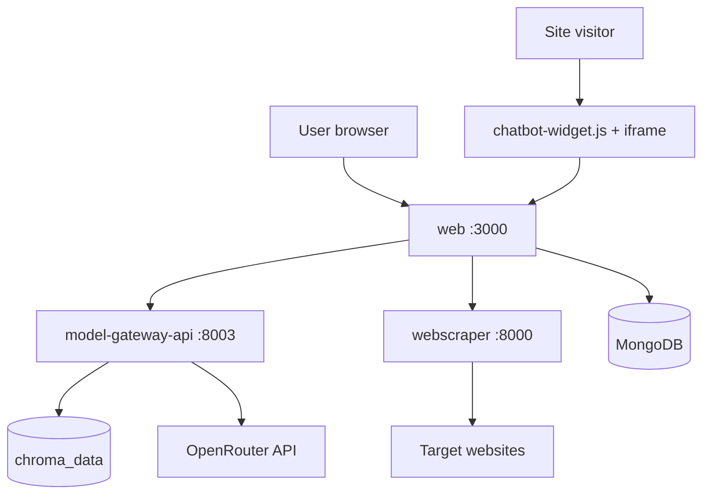
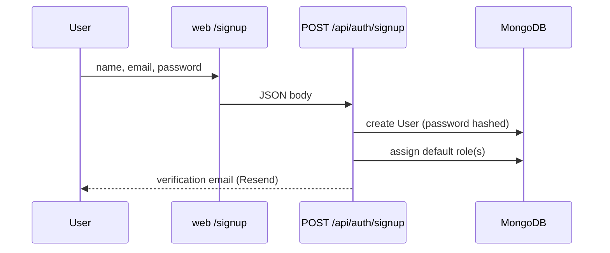
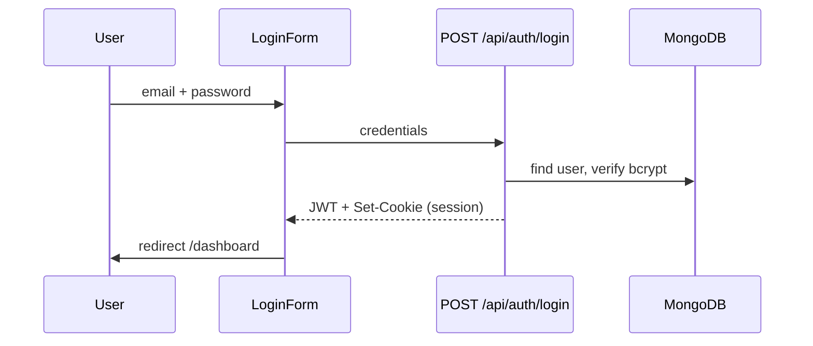
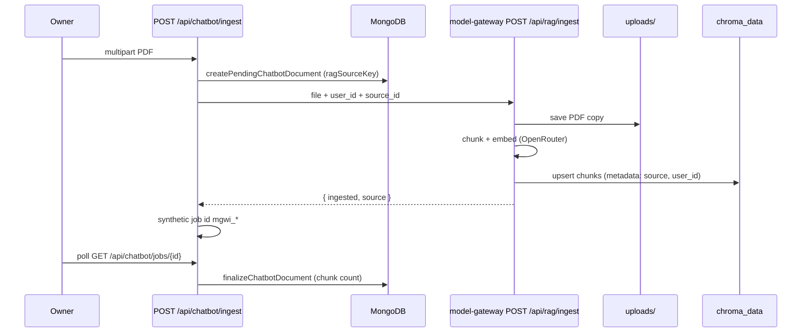
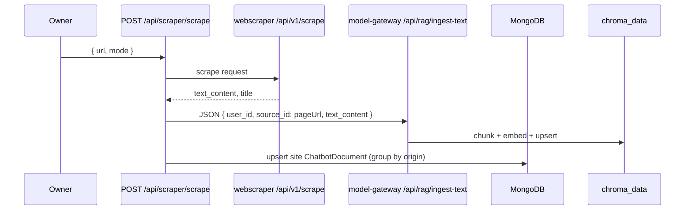
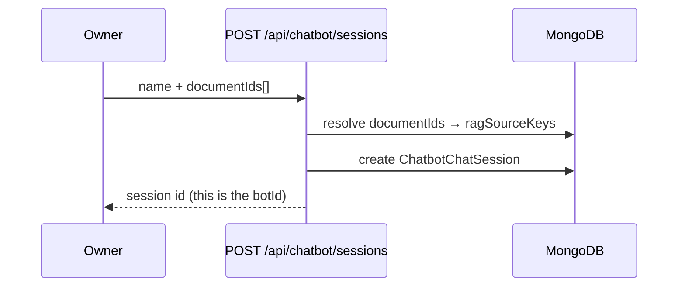
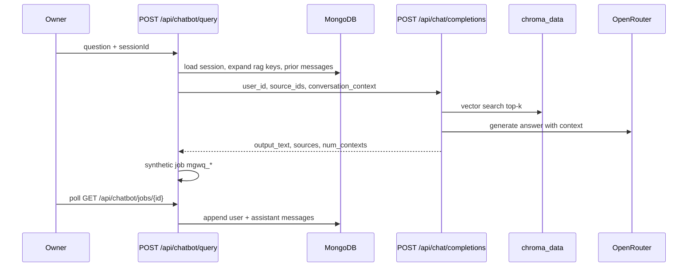
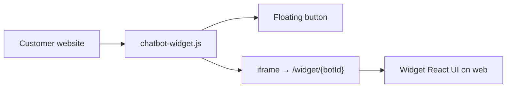
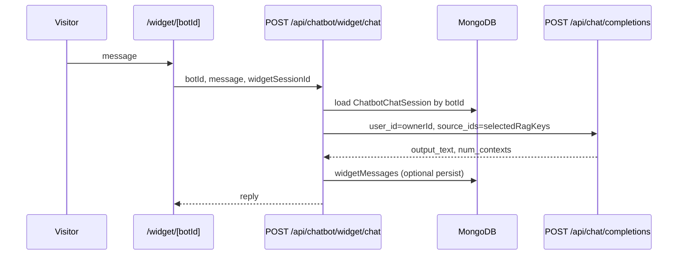

# Application Flow — Model Gateway + Webscraper

**Scope:** End-to-end product flow documented for the stack you run today:

- **`web`** (Next.js dashboard + API facade)
- **`model-gateway-api`** (chat, RAG ingest, vectors)
- **`webscraper`** (scrape / crawl)
- **MongoDB** (app data)
- **Chroma** (vector index)

**Out of scope:** `chatbot-api`, Inngest, and any path that requires `USE_CHATBOT_API=true`.

**Required web env:**

```env
USE_CHATBOT_API=false
MODEL_GATEWAY_API_URL=http://127.0.0.1:8003
SCRAPER_API_URL=http://localhost:8000
MONGODB_URI=...
MONGODB_DB_NAME=...
```

Shared Python env: **`monorepo/.env.shared`** (`CHROMA_*`, `EMBEDDING_*`, `OPEN_ROUTER_API_KEY`).

---

## 1. System overview



| Service | Port | Role |
| --- | --- | --- |
| `web` | 3000 | UI, auth, RBAC, proxies to backends |
| `model-gateway-api` | 8003 | PDF/text ingest, RAG chat, vector CRUD |
| `webscraper` | 8000 | Fetch and extract page text |
| MongoDB | cloud/local | Users, bots, documents, messages, jobs |
| Chroma | `monorepo/chroma_data` | Embeddings + chunk text for RAG |

---

## 2. Authentication & access

### 2.1 Sign up



- Page: `/signup`
- API: `POST /api/auth/signup`
- **Mongo:** `users` — email, `passwordHash`, `emailVerified`, `roleIds`

### 2.2 Email verification

- User opens link → `/verify-email?token=...`
- API: `POST /api/auth/verify-email`
- Sets `emailVerified` on the user document

### 2.3 Login



- Page: `/login`
- API: `POST /api/auth/login`
- Session: HTTP-only cookie (JWT)
- Middleware (`proxy.ts`): unauthenticated users hitting `/dashboard/*` → redirect `/login`

### 2.4 RBAC (permissions)

After login, every dashboard page and API route checks permissions (e.g. `chatbot_sessions:read`, `scraper:create`).

- **Mongo:** `roles`, `permissions`, `users.roleIds`
- Seeded on first use via `ensureRbacSeeded()`
- Sidebar items in `dashboardSidebarNav.ts` are permission-gated

---

## 3. Building the knowledge base

Documents must exist in the **library** before you create a chatbot. Two ways to add knowledge:

### 3.1 PDF upload (Upload Document)



| Step | Where |
| --- | --- |
| UI | `/dashboard/upload-document` |
| Web API | `POST /api/chatbot/ingest` |
| Gateway | `POST /api/rag/ingest` |
| Raw PDF | `apps/model-gateway-api/uploads/` (staging; not searched at query time) |
| Searchable data | **Chroma** collection `chatbot_chunks` |
| Library row | **Mongo** `chatbotdocuments` |

Each upload gets a unique **`ragSourceKey`** (Mongo ObjectId string). Multiple PDFs live in the **same** Chroma collection, distinguished by `source` metadata — not separate folders per PDF.

### 3.2 Web scraper — single page



| Step | Where |
| --- | --- |
| UI | `/dashboard/scraper` |
| Web API | `POST /api/scraper/scrape` |
| Scraper | `POST /api/v1/scrape` on port 8000 |
| Gateway | `POST /api/rag/ingest-text` |
| Chroma `source` | **Page URL** (e.g. `https://example.com/about`) |
| Mongo | One **site** row per origin (`https://example.com`) with `pages[]` |

### 3.3 Web scraper — multi-page crawl

- UI starts crawl → `POST /api/scraper/crawl` (or stream endpoint)
- **Mongo:** `crawljobs` — status, URLs, progress
- Worker (`crawlJobWorker`) processes stream events
- Each completed page → same path as 3.2 (`registerScrapedDocument` → model-gateway ingest-text)

---

## 4. Create a chatbot (session)



| Step | Where |
| --- | --- |
| UI | `/dashboard/chatbot/new` |
| API | `POST /api/chatbot/sessions` |
| **Mongo:** `chatbotchatsessions` | `name`, `primaryColor`, `selectedRagKeys[]`, `autoEscalationEnabled` |

- **`selectedRagKeys`** = which library documents this bot may search (Chroma `source` ids)
- Session **`id`** = **`botId`** used in the embed script

List bots: `GET /api/chatbot/sessions` → `/dashboard/chatbot`

---

## 5. Dashboard chat (test your bot)



| Step | Where |
| --- | --- |
| UI | `/dashboard/chatbot/[sessionId]` |
| Query API | `POST /api/chatbot/query` |
| Gateway | `POST /api/chat/completions` (with `user_id` + `source_ids` → RAG path) |
| Messages | **Mongo** `chatbotmessages` (per `sessionId`) |

Site-type documents: at query time `expandSessionRagKeys` expands one site key into all crawled page URLs in Chroma.

---

## 6. Customize widget (optional)

- Page: `/dashboard/customize`
- PATCH session: color, `autoEscalationEnabled`, linked documents
- API: `PATCH /api/chatbot/sessions/[sessionId]`
- Public widget config: `GET /api/chatbot/widget/config/[botId]`

---

## 7. Embed script (Get Script)

### 7.1 Owner copies snippet

- Page: `/dashboard/get-script`
- Loads bots from `GET /api/chatbot/sessions`
- Snippet format:

```html
<script src="https://YOUR_APP_ORIGIN/chatbot-widget.js" data-bot-id="SESSION_ID"></script>
```

Paste before `</body>` on any website.

### 7.2 What the script does



- File: `apps/web/public/chatbot-widget.js`
- Reads `data-bot-id`
- Opens iframe: `{origin}/widget/{botId}`
- Fetches colors from widget config API

### 7.3 Visitor chat (public)



| Piece | Detail |
| --- | --- |
| API | `POST /api/chatbot/widget/chat` (public, rate limited) |
| Backend | **model-gateway-api** when `USE_CHATBOT_API=false` |
| Session id | `widgetSessionId` in visitor localStorage |
| Escalation | `POST /api/chatbot/widget/escalation` → **Mongo** `escalations` + email |

---

## 8. Human escalation & inbox (summary)

| Feature | Flow |
| --- | --- |
| Visitor requests human | Widget → `POST /api/chatbot/widget/escalation` |
| Auto-escalation | Low `num_contexts` streak → ticket in Mongo |
| Owner inbox | `/dashboard/inbox` — **Mongo** `escalations` |
| Live takeover | SSE streams + `widgetMessages` |

---

## 9. Database (MongoDB)

Database name from `MONGODB_DB_NAME` (e.g. `auth_app`).

### Core collections

| Collection | Model | Purpose |
| --- | --- | --- |
| `users` | `User` | Accounts: email, passwordHash, emailVerified, roleIds |
| `roles` | `Role` | Named roles (admin, user, …) |
| `permissions` | `Permission` | Permission strings |
| `chatbotdocuments` | `ChatbotDocument` | Knowledge library: filename/site, ragSourceKey, chunks, kind (`upload` \| `site`), pages[] |
| `chatbotchatsessions` | `ChatbotChatSession` | **Chatbots**: name, color, selectedRagKeys, autoEscalation |
| `chatbotmessages` | `ChatbotMessage` | Dashboard test chat history (user/assistant per sessionId) |
| `crawljobs` | `CrawlJob` | Multi-page crawl jobs and progress |
| `escalations` | `Escalation` | Human handoff tickets |
| `widgetmessages` | `WidgetMessage` | Visitor/agent/system messages on widget |
| `widgetconfigs` | `WidgetConfig` | Optional per-bot widget settings |
| `apirequestlogs` | `ApiRequestLog` | API request logging |

### Key relationships

```text
User
 ├── ChatbotDocument[]     (knowledge library)
 ├── ChatbotChatSession[]  (chatbots / botId)
 │    └── selectedRagKeys → points to document ragSourceKeys
 ├── ChatbotMessage[]      (dashboard chat, per sessionId)
 ├── CrawlJob[]
 └── Escalation[]          (inbox)

ChatbotChatSession.id  ==  botId in embed script
ChatbotChatSession.userId  ==  owner (RAG queries use this as Chroma user_id)
```

### Vector store (not Mongo)

| Store | Location | Contents |
| --- | --- | --- |
| **Chroma** | `monorepo/chroma_data` | All chunks for all users; filtered by `user_id` + `source` metadata |
| Collection name | `chatbot_chunks` (env) | Single collection; many PDFs/pages = many chunks, not many folders |

---

## 10. Model Gateway API endpoints (used by web)

| Method | Path | Used for |
| --- | --- | --- |
| `POST` | `/api/chat/completions` | Dashboard chat, widget chat (RAG when `user_id` sent) |
| `POST` | `/api/rag/ingest` | PDF upload |
| `POST` | `/api/rag/ingest-text` | Scraper / crawl text |
| `GET` | `/api/rag/sources?user_id=` | List vector sources, document backfill |
| `DELETE` | `/api/rag/sources/{id}?user_id=` | Delete vectors for a source |
| `GET` | `/api/health` | Health check |

---

## 11. Webscraper API endpoints (used by web)

| Method | Path | Used for |
| --- | --- | --- |
| `POST` | `/api/v1/scrape` | Single page text extraction |
| `POST` | `/api/v1/crawl/stream` | Multi-page crawl with SSE progress |
| `GET` | `/health` | Health check |

---

## 12. Happy-path checklist (owner journey)

1. **Sign up** → verify email → **login**
2. **Upload PDF** (`/dashboard/upload-document`) or **scrape** (`/dashboard/scraper`)
3. **New chatbot** (`/dashboard/chatbot/new`) — pick documents → create session
4. **Test chat** (`/dashboard/chatbot/[id]`)
5. **Customize** (optional) — color, auto-escalation
6. **Get script** — copy embed tag with `data-bot-id`
7. Publish script on your site → visitors chat via widget → optional escalations in **Inbox**

---

## 13. Run commands (this stack)

```powershell
cd monorepo
npm run setup          # once
npm run build          # production web build
npm run start --workspace=web
npm run start --workspace=model-gateway-api
npm run start --workspace=webscraper   # if scraping
```

Dev:

```powershell
npm run dev   # starts web + model-gateway + webscraper (+ chatbot-api may start but web ignores it when USE_CHATBOT_API=false)
```

---

## Related docs

- [RAG routing decision](./decisions/rag-ingest-per-backend-shared-chroma.md)
- [web architecture](./apps/web/architecture.md)
- [model-gateway-api architecture](./apps/model-gateway-api/architecture.md)
- [webscraper operations](./apps/webscraper/operations.md)
- Root [README](../README.md)
