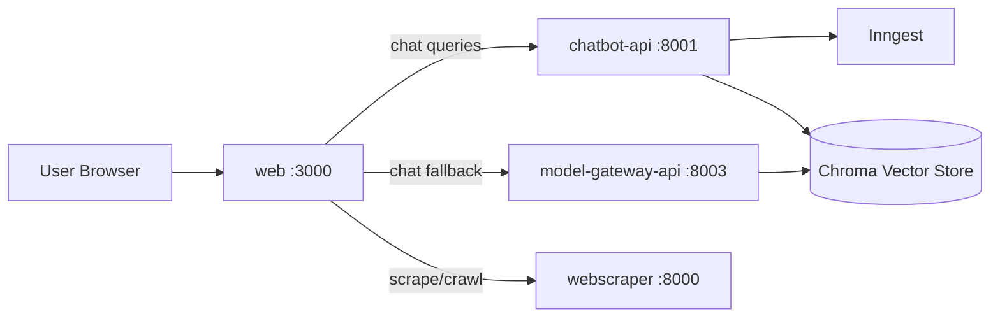

# Monorepo Documentation

This folder is the central documentation hub for all applications in this repository.

## Apps

- [`apps/web`](./apps/web/README.md) - Next.js frontend, auth/RBAC, API facade, and job orchestration.
- [`apps/chatbot-api`](./apps/chatbot-api/README.md) - FastAPI RAG service with Inngest-based async jobs.
- [`apps/model-gateway-api`](./apps/model-gateway-api/README.md) - FastAPI model gateway and direct RAG endpoints.
- [`apps/webscraper`](./apps/webscraper/README.md) - FastAPI scraping service for static/dynamic pages and streaming crawl.

## System Flow

## Conventions

- Keep docs in this folder as the source of truth.
- Update app docs whenever endpoint behavior, env vars, or runtime flows change.
- Keep app-specific details under `docs/apps/<app>/`.
