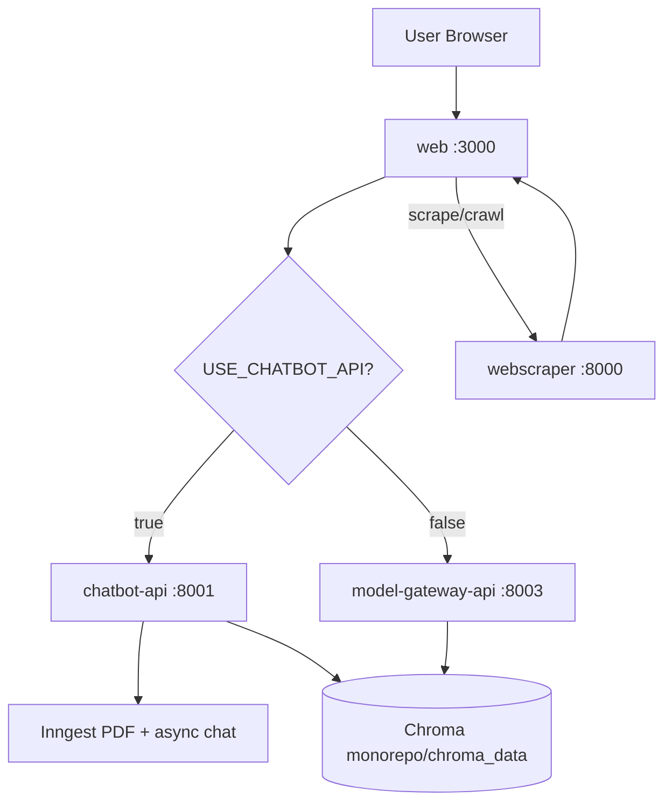

# Monorepo Documentation

This folder is the central documentation hub for all applications in this repository.

## Product flow (recommended read)

- [`APPLICATION_FLOW_MODEL_GATEWAY.md`](./APPLICATION_FLOW_MODEL_GATEWAY.md) — full journey from login → knowledge base → chatbot → embed script ( **model-gateway-api + webscraper only** ).
- [`TRIAL_MODE_FLOW.md`](./TRIAL_MODE_FLOW.md) — trial quotas, limit reached, Stripe subscription upgrade, admin plans.

## Apps

- [`apps/web`](./apps/web/README.md) - Next.js frontend, auth/RBAC, API facade, and job orchestration.
- [`apps/chatbot-api`](./apps/chatbot-api/README.md) - FastAPI RAG service with Inngest-based async jobs.
- [`apps/model-gateway-api`](./apps/model-gateway-api/README.md) - FastAPI model gateway and direct RAG endpoints.
- [`apps/webscraper`](./apps/webscraper/README.md) - FastAPI scraping service for static/dynamic pages and streaming crawl.

## System Flow

```mermaid
flowchart TD
    U[User Browser] --> W[web :3000]
    W --> Q{USE_CHATBOT_API?}
    Q -->|true| C[chatbot-api :8001]
    Q -->|false| M[model-gateway-api :8003]
    W -->|scrape/crawl| S[webscraper :8000]
    C --> I[Inngest PDF + async chat]
    C --> V[(Chroma monorepo/chroma_data)]
    M --> V
    S --> W
```

### RAG routing (chat, ingest, vectors)

**`USE_CHATBOT_API`** in `apps/web` selects the backend for **chat**, **PDF ingest**, **scrape→text ingest**, and **vector list/delete**. There is no separate ingest service.

| Toggle | Python service | Inngest needed? |
| --- | --- | --- |
| `true` | `chatbot-api` | Yes for **PDF** ingest and async **chat** |
| `false` | `model-gateway-api` | No — ingest and chat are sync |

Both backends share **`CHROMA_PERSIST_DIR`** / **`CHROMA_COLLECTION`** via **`monorepo/.env.shared`** (default `monorepo/chroma_data`). Web helper: `apps/web/lib/chatbot/ragService.ts`.

Optional **`monorepo/.env.shared`** (from `.env.shared.example`) supplies shared embedding and Chroma defaults; each Python app’s `.env` / `.env.local` overrides on duplicate keys.

## Architecture Decisions

- [`decisions/rag-ingest-per-backend-shared-chroma.md`](./decisions/rag-ingest-per-backend-shared-chroma.md) — colocated ingest on each backend + shared Chroma (current).
- [`decisions/keep-rag-ingest-in-chatbot-api.md`](./decisions/keep-rag-ingest-in-chatbot-api.md) — superseded (ingest only on chatbot-api).

## Implementation Plans

- [`plans/chat-conversation-tabs.md`](./plans/chat-conversation-tabs.md) — ChatGPT-style conversation threads per chatbot (dashboard).

## Conventions

- Keep docs in this folder as the source of truth.
- Update app docs whenever endpoint behavior, env vars, or runtime flows change.
- Keep app-specific details under `docs/apps/<app>/`.
- Record significant architecture choices under `docs/decisions/`.
