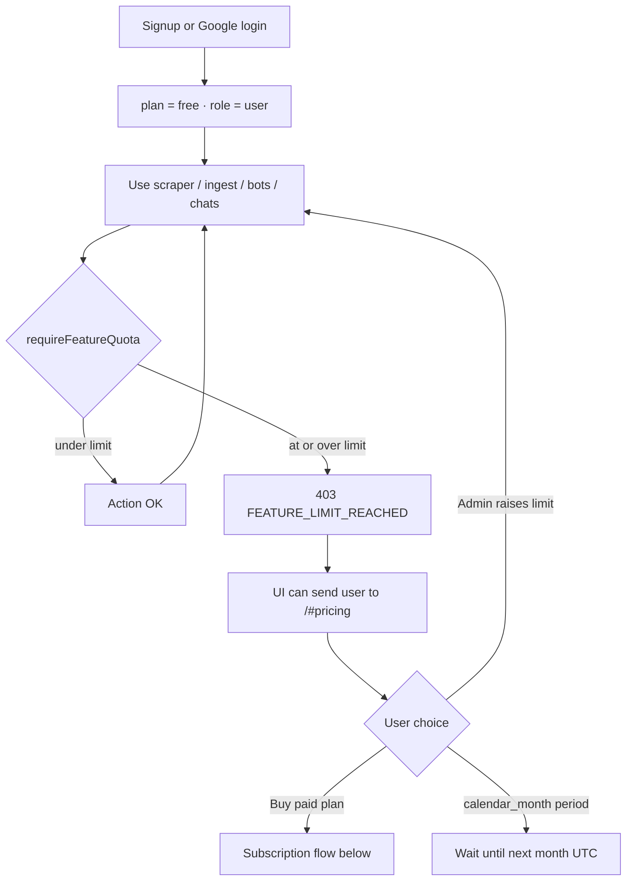
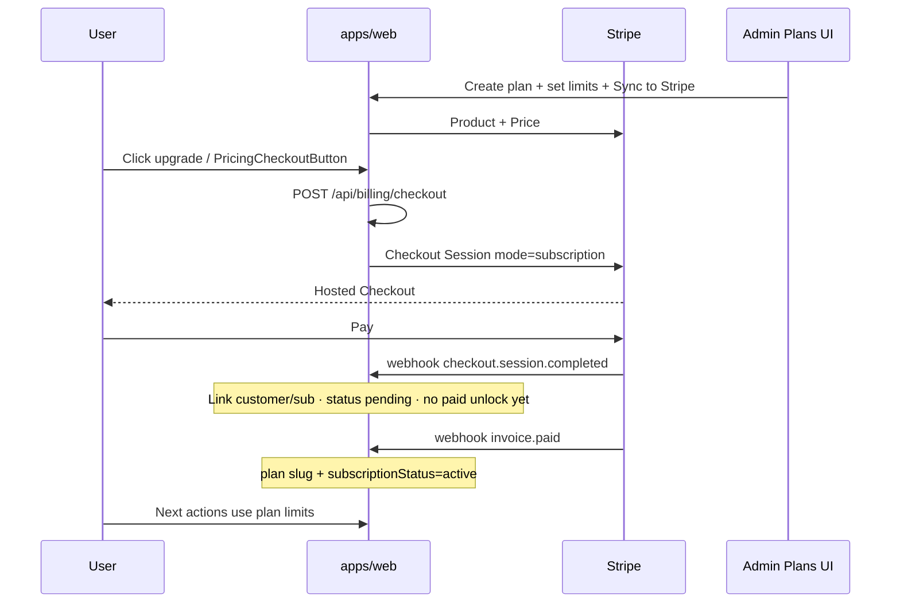

# Trial Mode & Subscription Flow

**Scope:** How free/trial quotas work, what happens when a limit is reached, and how paid Stripe subscriptions unlock higher limits.

---

## 1. Big picture

```text
New user  →  plan = free  →  trial quotas (global Feature Limits ± per-user override)
Limit hit →  403 FEATURE_LIMIT_REACHED  →  upgrade CTA / pricing
Buy plan  →  Stripe Checkout  →  invoice.paid  →  plan active  →  plan’s higher limits
Cancel    →  webhook  →  back to free / trial quotas
```

| Mode | How quotas are chosen |
| --- | --- |
| **Free / trial** (`plan` empty or `free`, or subscription not `active`) | Global Feature Limits + optional per-user override |
| **Paid** (`subscriptionStatus === "active"` and plan ≠ `free`) | Limits from that **Subscription Plan** (admin Plans UI), then per-user override still wins if set |

---

## 2. Trial / free flow



### What is limited (same keys for trial and paid plans)

| Limit key | Counts | Gated routes |
| --- | --- | --- |
| `scraperRuns` | One-shot scrape + crawl jobs | `/api/scraper/scrape`, `/api/scraper/crawl/jobs` |
| `documentUploads` | PDF uploads | `/api/chatbot/ingest` |
| `botsCreated` | Chat sessions | `/api/chatbot/sessions` |
| `dashboardChats` | Dashboard user messages | `/api/chatbot/query` |
| `widgetChats` | Widget visitor messages (bot **owner**) | `/api/chatbot/widget/chat` |

Period: `lifetime` or `calendar_month` (global defaults for free; each paid plan has its own `limitPeriod`).

Admin surfaces:

- **Feature limits** — `/dashboard/admin/limits` — global free/trial defaults  
- **Users & roles** — per-user overrides  
- **Plans** — `/dashboard/admin/plans` — paid plan definitions + Stripe sync  

---

## 3. When a limit is reached

1. Action hits `requireFeatureQuota` (`apps/web/lib/limits/requireFeatureQuota.ts`).
2. Effective limits come from `resolveEffectiveFeatureLimits` (`featureLimitRepo.ts`):
   - If paid + `active` → plan limits  
   - Else → global feature-limit defaults  
   - Then apply per-user override if present  
3. If `used >= limit` → **403** with:
   - `code: "FEATURE_LIMIT_REACHED"`
   - `quota: { key, limit, used, remaining, period }`
   - `upgradeUrl` (e.g. `/#pricing`)
4. Action does **not** run.

---

## 4. Subscription / buy flow (implemented)



### Pieces in the repo

| Piece | Path / route |
| --- | --- |
| Stripe client | `apps/web/lib/billing/stripe.ts` |
| Plan helpers | `apps/web/lib/billing/plans.ts` |
| Checkout | `POST /api/billing/checkout` |
| Customer portal | `POST /api/billing/portal` |
| Webhooks | `POST /api/billing/webhook` |
| Public plans list | `GET /api/billing/plans` |
| Landing pricing UI | `components/billing/PricingSection.tsx` |
| Checkout button | `components/billing/PricingCheckoutButton.tsx` |
| Manage billing | `components/billing/ManageBillingButton.tsx` (profile) |
| Admin plans | `components/dashboard/PlansAdminClient.tsx` |
| Plan Mongo model | `lib/db/subscriptionPlanRepo.ts` |
| User billing fields | `plan`, `subscriptionStatus`, `stripeCustomerId`, `stripeSubscriptionId` on User |

### Webhook policy (source of truth)

| Event | Effect |
| --- | --- |
| `checkout.session.completed` | Link Stripe customer / subscription; status **pending**; **do not** grant paid limits yet |
| `invoice.paid` | Assign plan slug + **active** (unlock paid limits) |
| `invoice.payment_failed` | `past_due` |
| `customer.subscription.updated` | Sync status only |
| `customer.subscription.deleted` | Downgrade to **free** |

Paid access helper: `hasActivePaidAccess(plan, status)` → `status === "active"` and plan ≠ `free`.

### Admin setup steps (ops)

1. Create a plan in **Admin → Plans** (slug, price, feature limits).  
2. **Sync to Stripe** so the plan gets `stripePriceId` (`syncStatus: synced`).  
3. Configure Stripe webhook → `/api/billing/webhook`.  
4. Set env: `STRIPE_SECRET_KEY`, `STRIPE_WEBHOOK_SECRET`, `NEXT_PUBLIC_APP_URL` (and any public Stripe keys the UI needs).  
5. Users buy from landing/pricing → Checkout → after `invoice.paid`, quotas follow that plan.

---

## 5. Resolve order for quotas

```text
1. Start from global FeatureLimitDefaults
2. If user has active paid plan → replace with that plan’s limits + period
3. If UserFeatureLimitOverride exists → overlay those keys
4. Compare live Mongo usage vs effective limit
```

So: **admin per-user override always wins** over both free defaults and paid plan limits.

---

## 6. What is *not* “trial-only” anymore

Earlier notes that said “billing is not built” were **outdated**. Subscription checkout, portal, webhooks, and plan-based limits **are** in `apps/web`.

What you may still need for production:

- Stripe keys + webhook endpoint configured on the droplet  
- At least one plan created and **synced**  
- UI polish when 403 fires (show upgrade toast / modal everywhere)

---

## 7. Quick test checklist

**Trial**

1. User on free plan; set document uploads to `1` globally.  
2. First upload OK; second → 403 + upgrade hint.  

**Paid**

1. Admin creates plan with higher limits → Sync to Stripe.  
2. User checks out via pricing button.  
3. After webhook `invoice.paid`, user `plan` + `subscriptionStatus=active`.  
4. Same upload under free limit now succeeds under plan limits.  
5. Cancel in Stripe portal → `subscription.deleted` → back to free quotas.
