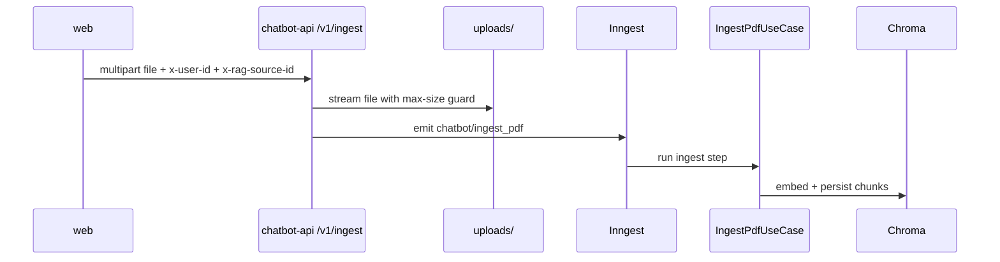
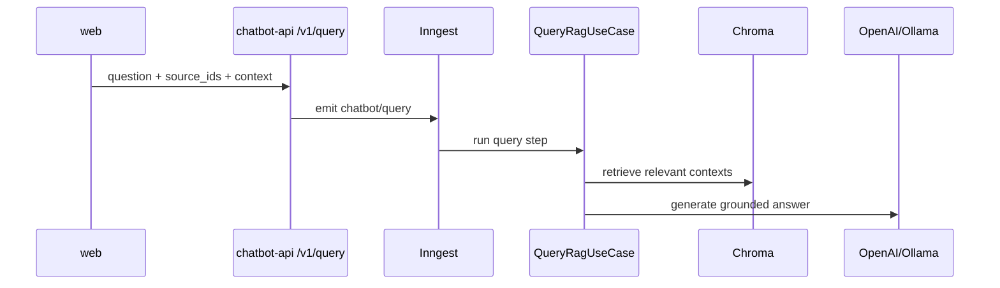

# chatbot-api Architecture

## Core Modules

- `app/main.py` - FastAPI app, route handlers, Inngest function wiring, exception mapping.
- `app/engine.py` - use-case orchestration for ingest/query.
- `app/vector_store.py` - Chroma-backed storage access.
- `app/providers/*` - model provider clients and provider selection.
- `app/auth.py` - authenticated user resolution.
- `app/contracts.py` - request/response contract models.

## Ingest Flow (PDF)

## Query Flow

## Key Design Notes

- Async and sync query endpoints both exist (`/v1/query`, `/v1/query/sync`).
- Error handling returns JSON with stable shape, including a request ID on 500s.
- Auth context is passed from `web` via `x-user-id` and validated server-side.
