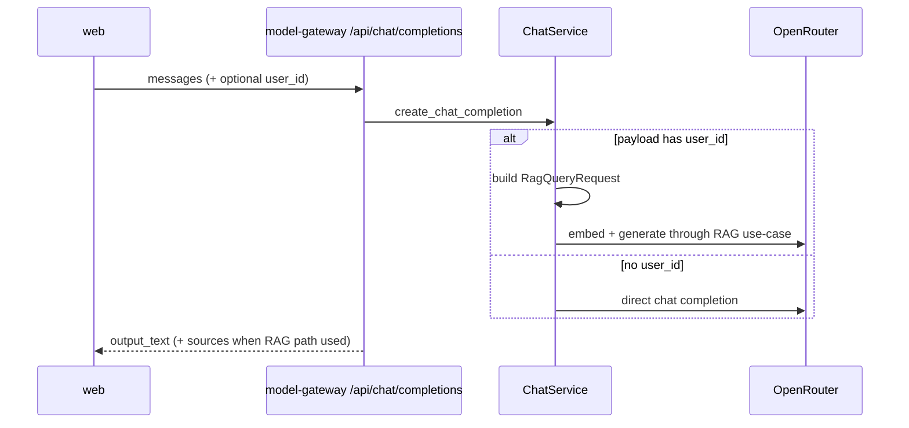
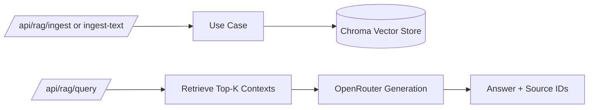

# model-gateway-api Architecture

## Core Modules

- `app/main.py` - FastAPI app bootstrap and router inclusion.
- `app/api/router.py` - route registration (`health`, `chat`, `rag`).
- `app/services/chat_service.py` - chat completion and RAG orchestration.
- `app/providers/openrouter_provider.py` - model and embedding provider calls.
- `app/rag/*` - ingest/query use cases and Chroma vector storage.
- `app/core/config.py` - env and allowed free model configuration.

## Completion Flow

## RAG Ingest/Query Flow

## Key Design Notes

- Chat service enforces `FREE_MODELS` from config for model selection.
- RAG can be triggered from chat completions when `user_id` is supplied.
- Chroma store location defaults to a monorepo-level `chroma_data` directory.
