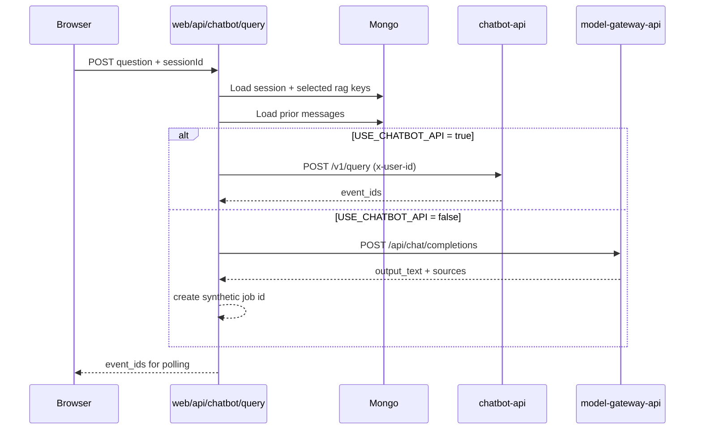
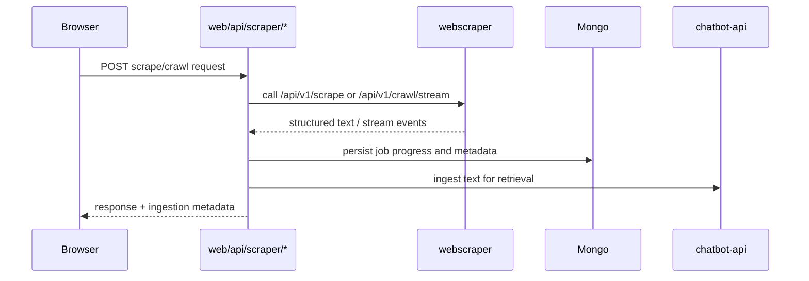

# web Architecture

## High-Level Components

- `app/` - App Router pages and route handlers.
- `components/` - UI components and feature-level clients.
- `lib/auth` - Auth, permission checks, and RBAC enforcement.
- `lib/db` - Data repositories for MongoDB-backed entities.
- `lib/chatbot` - Upstream proxy and service-selection helpers.
- `lib/scraper` - Crawl worker orchestration and scrape ingestion mapping.

## Query Flow

## Scraper Flow

## Security and Control Points

- Route-level permission gates via `requireUserIdWithPermission(...)`.
- Per-user rate limiting on high-cost routes.
- Service calls normalized through helper utilities for consistent upstream error handling.
