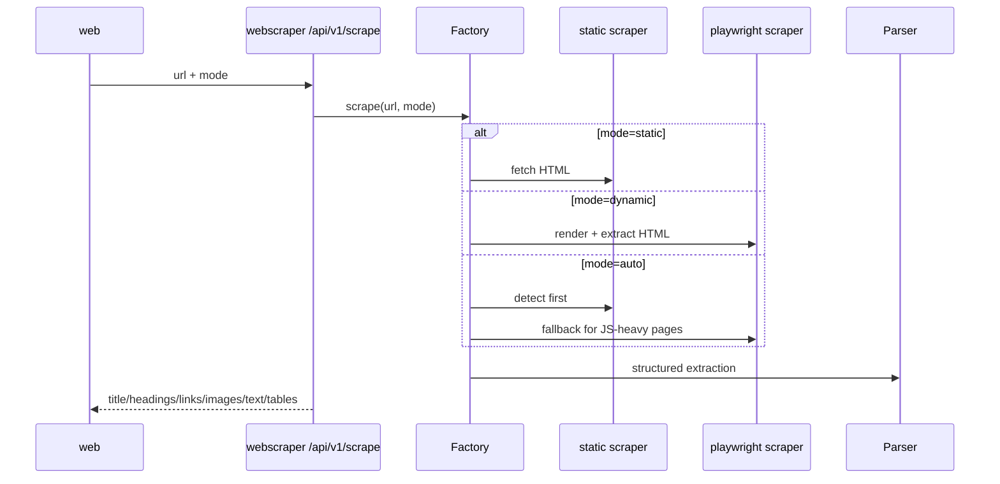
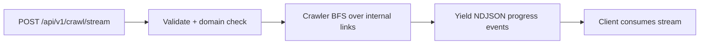

# webscraper Architecture

## Core Modules

- `app/main.py` - FastAPI app setup and middleware registration.
- `app/api/router.py` - `/scrape` and `/crawl/stream` endpoints.
- `app/api/middleware.py` - API key and rate limiting middleware.
- `app/scraper/factory.py` - mode selection and execution orchestration.
- `app/scraper/static_scraper.py` - httpx-based fetch.
- `app/scraper/dynamic_scraper.py` - Playwright-based fetch.
- `app/scraper/crawler.py` - link traversal and streaming crawl events.
- `app/scraper/parser.py` - HTML to structured output.

## Scrape Flow

## Crawl Stream Flow

## Key Design Notes

- Domain allowlist and SSRF protections are enforced before scrape/crawl execution.
- Crawl endpoint streams incremental events to support long-running job monitoring.
- Middleware-driven rate limiting and API key support protect service capacity.
